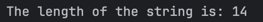
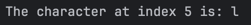
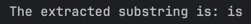
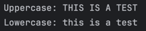
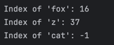
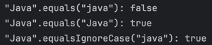
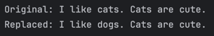
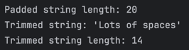

## Joana S. Tria
# Exploring Java String Methods

#### Exercise 1: length() - Finding the String's Size

Prediction:  
The length of the string is: 14

Actual: 

#### Exercise 2: charAt() - Accessing a Character
Prediction:  
The character at index 5 is: l

Actual: 

#### Exercise 3: substring() - Extracting a Part of a String
Prediction:  
The extracted substring is: is

Actual: 

#### Exercise 4: toUpperCase() and toLowerCase() - Changing Case
Prediction:  
Uppercase: THIS IS A TEST 
Lowercase: this is a test

Actual: 

#### Exercise 5: indexOf() - Finding a Character or Substring
Prediction:  
Index of 'fox': 16 
Index of 'z': 37 
Index of 'cat': -1

Actual: 

#### Exercise 6: equals() vs. equalsIgnoreCase() - Comparing Strings
Prediction:  
"Java".equals("java"): false  
"Java".equals("Java"): true  
"Java".equalsIgnoreCase("java"): true

Actual: 

#### Exercise 7: replace() - Replacing Characters
Prediction:  
Original: I like cats. Cats are cute.  
Replaced: I like dogs. Cats are cute.

Actual: 

#### Exercise 8: trim() - Removing Whitespace
Prediction:  
Padded string length: 20  
Trimmed string: 'Lots of spaces'
Trimmed string length: 14

Actual: 
